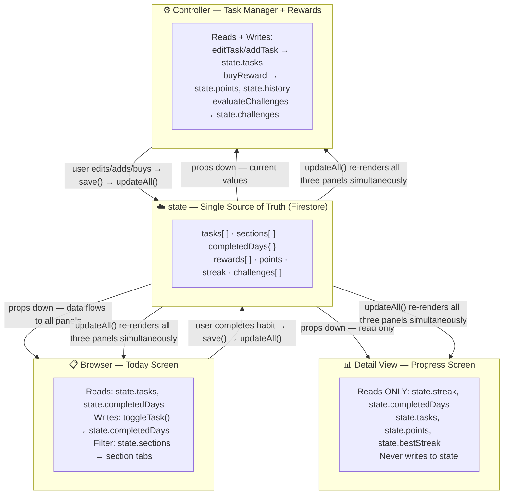
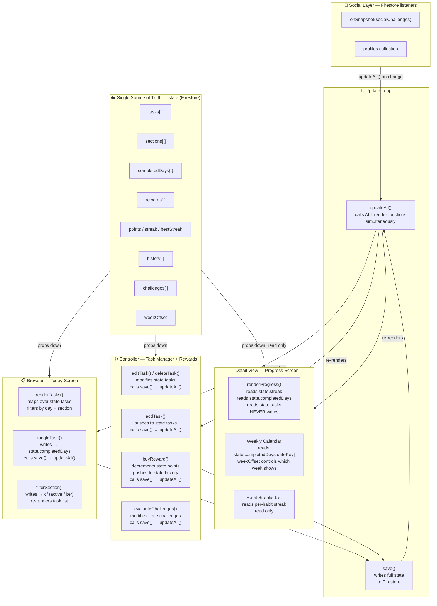

# Ritual — AI 201: The Reactive Sandbox

**Student:** Valeria Munera  
**Course:** AI 201 — Creative Computing with AI  
**Professor:** Tim Lindsey  
**Institution:** SCAD  
**Semester:** Spring 2026  

---

## Live Site

**[View Ritual Live](https://valeriamuneraa-debug.github.io/dino-days/)**

---

## Project Overview

Ritual is a daily habit tracker and personal accountability system built as a reactive three-panel application. Users build custom habit routines organized into sections, earn points for daily completions, track streaks and progress over time, redeem points for personal rewards, and compete or collaborate with friends through social challenges.

The three panels share a single `state` object. Every user action in one panel instantly updates all others — completing a habit on the Today screen immediately reflects in the streak counter, the progress ring, the sidebar stats, and any active challenges. No panel stores its own copy of any data.

**The three panels:**
- **Browser — Today Screen:** Maps over `state.tasks`, renders habits filtered by section and day, writes completion data back to `state.completedDays`
- **Detail View — Progress Screen:** Reads `state.streak`, `state.completedDays`, and `state.tasks` — never writes, only reacts
- **Controller — Task Manager + Rewards:** Modifies `state.tasks`, `state.sections`, `state.rewards`, and `state.points` — every change triggers `updateAll()` across all panels

---

## Design Intent

**Domain:** Daily habit tracking with social accountability  
**Architecture choice:** Vanilla JS with a global `state` object and `save()` → `updateAll()` loop — equivalent to React's lifted state with props-down/events-up, chosen for zero-build-step GitHub Pages deployment and PWA compatibility

**State shape:**
```json
{
  "tasks": [{ "id": "t1", "name": "Morning run", "emoji": "🏃", "points": 10, "section": "morning", "days": [1,2,3,4,5] }],
  "sections": [{ "id": "morning", "label": "Morning", "emoji": "☀️" }],
  "completedDays": { "2026-04-29": { "t1": true } },
  "rewards": [{ "id": "r1", "name": "Spa day", "cost": 120, "icon": "💆" }],
  "points": 340,
  "streak": 12,
  "bestStreak": 21,
  "history": [],
  "challenges": [],
  "weekOffset": 0
}
```

**Typography:**
- Display / headings: Fraunces (serif) — 28–52px, weights 600–700
- Body / UI: DM Sans (geometric sans) — 11–18px, weights 400–500
- Codes / identifiers: Monospace — 20–26px, letter-spacing 3–4px

**Color palette:**
| Token | Hex | Role |
|---|---|---|
| `--ink` | `#1d1e1e` | Primary text, headings |
| `--ink-soft` | `#5a5550` | Secondary text |
| `--ink-faint` | `#9a908a` | Metadata, labels |
| `--linen` | `#EFE5DC` | Hero gradient start |
| `--powder` | `#F3D8C7` | Hero gradient end |
| `--almond` | `#D0B8AC` | Accent, streak, highlights |
| `--white` | `#FFFFFF` | Cards, sidebar |

**Visual hierarchy rules:** Three-level ink system (`--ink` / `--ink-soft` / `--ink-faint`) controls reading priority. Scale signals importance — Fraunces at 44px anchors the most critical number per screen. Surface elevation creates depth: warm linen gradient for hero moments, white cards for content, single dark gradient for the Rewards points header. Spacing follows Gestalt proximity — section labels belong to what follows them, not what precedes them.

**Full Design Intent document:** [View PDF](docs/Assignment%202%20Design%20Intent.pdf)

---

## System Diagram

[View full system diagram](docs/system-diagram.md)

### Architecture Overview



### Detailed System Flow



---

## AI Direction Log

See full log: [docs/AI-DIRECTION-LOG.md](docs/AI-DIRECTION-LOG.md)

**Summary of key sessions:**
- Architectural decision — vanilla JS over React for deployability
- State model consolidation — all data into one `state` object, all renders through `updateAll()`
- Three-panel wiring — Today, Progress, Task Manager sharing one source of truth
- Pet system build — full dinosaur with hearts, health states, revival mechanics
- **Pivot** — removed dinosaur entirely, replaced with Challenges system, renamed app from Dino Days to Ritual
- Social features — friends system, Race mode, Bond mode, Custom mode with Firestore real-time listeners
- Rewards architecture — user-defined pleasures, purchase history, undo redemption snackbar
- Per-day habit scheduling — `days` array per habit, `renderTasks()` filters by current weekday
- Desktop layout — two-column sidebar + main, `position: absolute` onboarding overlay contained within `#app`

---

## Records of Resistance

See full records: [docs/RECORDS-OF-RESISTANCE.md](docs/RECORDS-OF-RESISTANCE.md)

**Summary:**
1. Rejected the dinosaur entirely after building it — pivoted to social Challenges system
2. Rejected `position: fixed` for desktop onboarding overlay across three sessions — enforced `position: absolute` inside `#app`
3. Rejected AI's three-difficulty-mode proposal — kept single consistent rule set to reduce cognitive load
4. Rejected hardcoded section dropdowns in modals — enforced dynamic loop over `state.sections`
5. Rejected centered tour tooltip positioning — directed anchor to right of highlighted element using `getBoundingClientRect()`
6. Rejected emoji navigation icons — replaced with custom inline SVGs for cross-platform consistency
7. Rejected rewards lockout mechanic tied to the removed pet system

---

## Five Questions

Yes, I can defend every decision in this project. One of my first choices was the choice to use vanilla JS over React. Additionally, the global `state` object as a single source of truth, the `save()` → `updateAll()` loop as the equivalent of props-down/events-up, and the three-panel architecture mapped to Today (Browser), Progress (Detail View), and Task Manager (Controller). This design is completely mine. Throughout the entire process, I've made annotations for changes within the app, examples including the decision to remove the dinosaur after building it, pivoting to a social challenge system, directing the reward economy, specifying per-day habit scheduling, and rejecting difficulty modes AI built. These are all choices that came from me, and I have the annotation history and records of resistance to demonstrate it. I verified the cross-panel state sharing by completing habits on Today and watching the streak counter, points total, and progress ring update simultaneously without any panel storing its own copy of the data. I could explain the pattern to a classmate in the following way: when you tap a habit, `toggleTask()` updates `state.completedDays`, `save()` writes it to Firestore, and `updateAll()` calls every render function, they all read from the same `state`, so they all reflect the change at once. And my documentation is honest, including one gap between my work and the class instructions: my Detail View is time-based rather than item-based, meaning the "selected item" is a week offset rather than a habit ID, which is a deliberate architectural choice I made when I decided the Progress screen should show aggregate history rather than detailing a single habit.

---

## Tech Stack

- Vanilla JavaScript (no framework)
- Firebase / Firestore (auth + real-time database)
- CSS custom properties (theming system)
- GitHub Pages (deployment)
- PWA — installable via Safari on iPhone

---

## ESF Documentation

All ESF documentation is in the `docs/` folder:

| File | Contents |
|---|---|
| [AI-DIRECTION-LOG.md](docs/AI-DIRECTION-LOG.md) | Full AI Direction Log — 10 entries |
| [RECORDS-OF-RESISTANCE.md](docs/RECORDS-OF-RESISTANCE.md) | Full Records of Resistance — 7 entries |
| [system-diagram.md](docs/system-diagram.md) | Mermaid system flow diagram |
| [Assignment 2 Design Intent.pdf](docs/Assignment%202%20Design%20Intent.pdf) | Original Design Intent document |

---

## Local Setup

```bash
# From project root, start a local server
python3 -m http.server 8080
```

Open `http://localhost:8080` in your browser.

---

*Ritual — Your habits, your rules.*
