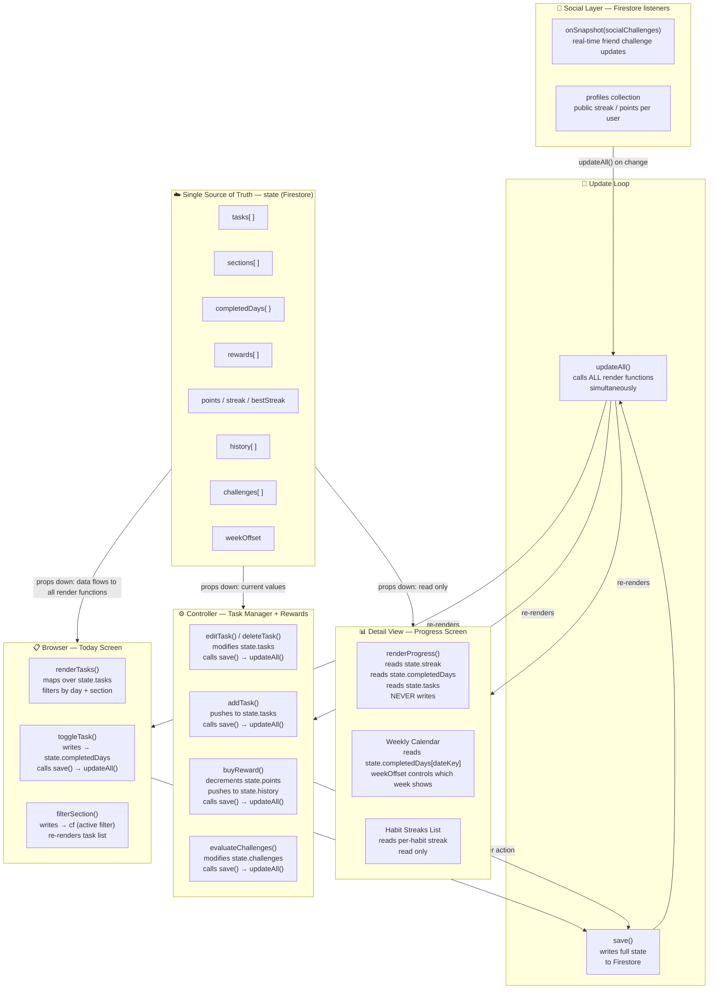

# System Diagram — Ritual

**Project:** Ritual — Daily Habit Tracker  
**Course:** AI 201 — Creative Computing with AI  
**Architecture:** Browser → Detail View → Controller sharing a single `state` object

